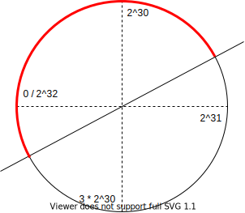

# Postgres-XID-wraparound-failure

PostgresSQL database provides a non-block read/write model by multiversion concurrency control (MVCC).
The MVCC can be simply described as "rows created *in the future* or deleted *in the past* are invisible to current transcation".
To determine whether a row is *in the future* or *in the past* of a trascation, Postgres assigns an incrementing 32-bits interger, **transcation ID** (XID), to each trancation.
For instance, a row created by a transcation has a `XMIN` value equals to XID of the transcation, indicating this row is visible only to transcations in the future of `XMIN`.

Given a transcation with `XID` and a row with `XMIN`, there is a basic algorithm to determine the visibility:
```C
bool isVisible(unsigned int XID, unsigned int XMIN){
  return XID > XMIN;
}
```

An obvious problem is that the number of transcations might be beyond the scope of 32-bits interger.
Once the XID increases up to the limit of 32-bits, it wraps around to zero. Then all the rows actually in the past appear to be in the future.

To avoid wrap-around failure, Postgres actually uses a modulo 2^32 arithmetic:
```C
bool isVisible(unsigned int XID, unsigned int XMIN){
  return  XID - XMIN < 2^31;
}
```

We can think of XIDs space as a circle, where the number in the half round of clockwise direction is greater and the other half is less.



However, this algorithm works only if when a new transcation begins, there is no older row with `XMIN` in the greater half round.
So Postgres *freezes* those rows which are *old enough*. A frozen row is always in the past of any transcation with a normal XID.
The progress of freezing rows and reusing `XID` is done by `VACUUM`.
